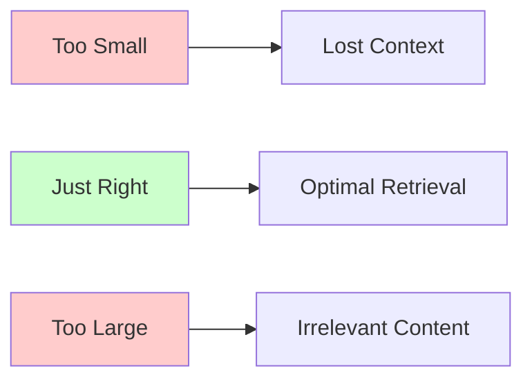
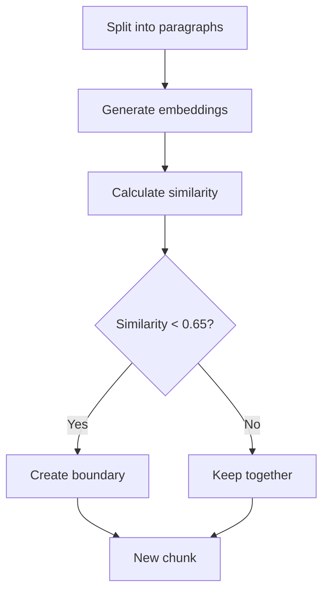
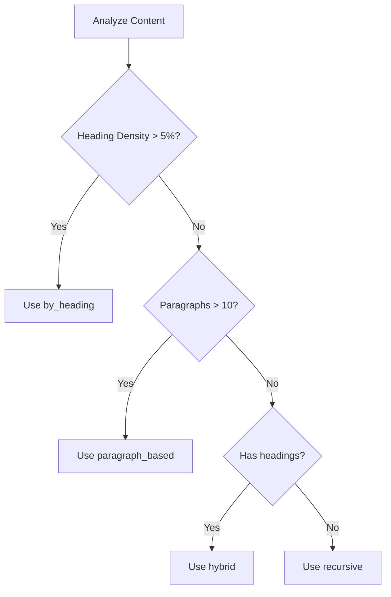
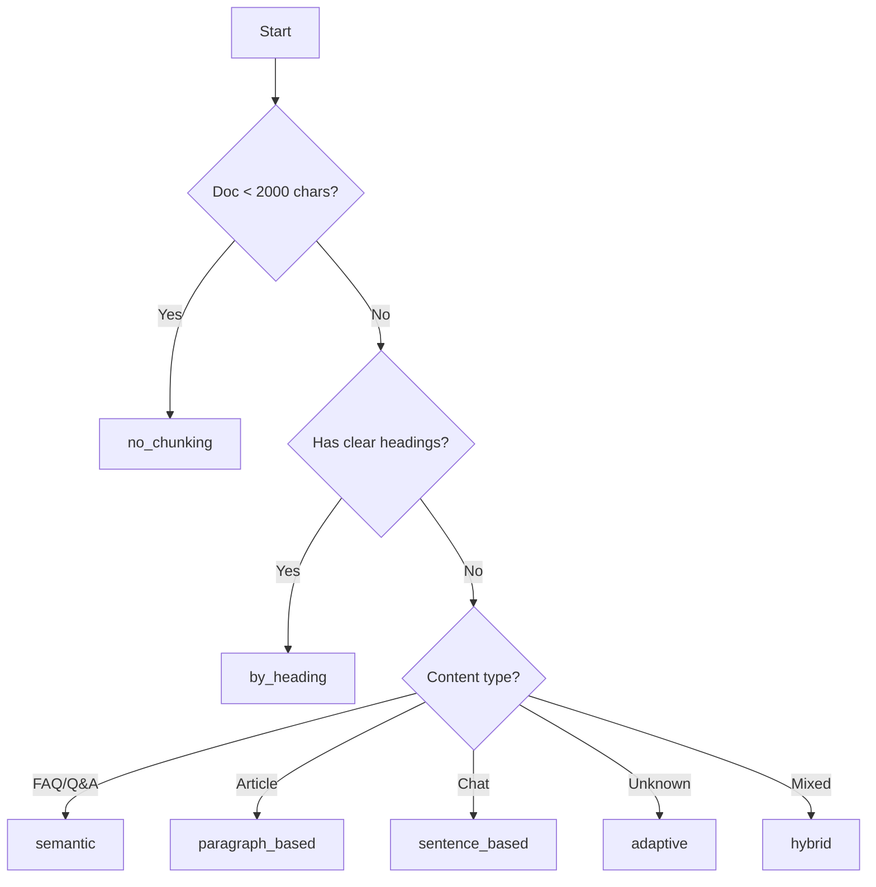

# Chunking Strategies

Chunking is the art of splitting documents into semantically meaningful pieces. The right strategy dramatically impacts retrieval quality and chatbot accuracy.

## Why Chunking Matters

The chunking dilemma visualized:



### Impact on Performance

| Chunk Size | Precision | Context | Speed | Best For |
|------------|-----------|---------|-------|----------|
| **Small** (200-500) | ⭐⭐⭐⭐⭐ | ⭐⭐ | ⭐⭐⭐⭐⭐ | FAQs, definitions |
| **Medium** (500-1000) | ⭐⭐⭐⭐ | ⭐⭐⭐⭐ | ⭐⭐⭐⭐ | General content |
| **Large** (1000-2000) | ⭐⭐ | ⭐⭐⭐⭐⭐ | ⭐⭐⭐ | Complex explanations |

## Available Strategies

### Strategy Comparison Matrix

| Strategy | Algorithm | Best For | Pros | Cons |
|----------|-----------|----------|------|------|
| **Recursive** | Hierarchical splits | General | Versatile, reliable | May split mid-thought |
| **By Heading** | Markdown headers | Documentation | Preserves structure | Needs headings |
| **Semantic** | AI boundaries | Q&A content | Smart splits | Slower, needs AI |
| **Paragraph** | Double newlines | Articles | Natural breaks | Variable sizes |
| **Sentence** | Punctuation | Chat logs | Precise | Less context |
| **Adaptive** | Auto-select | Unknown | Intelligent | Less predictable |
| **Hybrid** | Multi-stage | Complex docs | Best of both | More processing |
| **No Chunking** | None | Small docs | Complete context | Large chunks |

## Strategy Deep Dives

### 1. Recursive Strategy (Default)

The Swiss Army knife of chunking - works for almost everything.

#### How It Works

```python
# Hierarchical separator sequence
separators = ["\n\n", "\n", " ", ""]

# Split by largest separator first
# If chunk too large, split by next separator
# Continue until all chunks fit size limit
```

#### Visual Example

```
Original Text
    │
    ├─ Split by paragraphs (\n\n)
    │   │
    │   ├─ Still too large?
    │   ├─ Split by lines (\n)
    │   │   │
    │   │   ├─ Still too large?
    │   │   └─ Split by words ( )
    │   │
    │   └─ Chunk complete
    │
    └─ All chunks sized correctly
```

#### Configuration

```javascript
{
  "strategy": "recursive",
  "chunk_size": 1000,
  "chunk_overlap": 200,
  "preserve_code_blocks": true
}
```

#### When to Use

- ✅ General-purpose content
- ✅ Mixed content types
- ✅ First-time users (safe default)
- ✅ Fallback strategy

### 2. By Heading Strategy

Perfect for structured documentation with clear sections.

#### How It Works

Splits content at markdown heading boundaries:

```markdown
# Main Section        ← Split here
Content...

## Subsection        ← Split here
More content...

### Sub-subsection   ← Split here
Details...
```

#### Algorithm

```python
# Detect headings
heading_pattern = r'^#{1,6}\s+(.+)$'

# Create chunks with:
# - Heading as context
# - Section content
# - Metadata about level
```

#### Real-World Example

```
Input Document:
# Installation Guide
This guide explains installation...

## Prerequisites
Before you begin...

## Step 1: Download
Download from...

Output Chunks:
Chunk 1: "# Installation Guide\nThis guide..."
Chunk 2: "## Prerequisites\nBefore you begin..."
Chunk 3: "## Step 1: Download\nDownload from..."
```

#### Configuration

```javascript
{
  "strategy": "by_heading",
  "chunk_size": 1000,
  "chunk_overlap": 200,
  "min_heading_length": 100,  // Minimum content under heading
  "include_heading_hierarchy": true
}
```

#### When to Use

- ✅ Technical documentation
- ✅ API references
- ✅ User guides
- ✅ Content with &gt;5% heading density

### 3. Semantic Strategy

AI-powered chunking that detects topic boundaries.

#### How It Works



#### Similarity Thresholds

| Threshold | Behavior | Result |
|-----------|----------|--------|
| 0.3 | Very different topics | Many small chunks |
| 0.5 | Moderate changes | Balanced |
| **0.65** (default) | Clear shifts | Natural boundaries |
| 0.8 | Very similar only | Fewer, larger chunks |

#### Example Output

```
Input: Blog post about AI then about cooking

Semantic Analysis:
Paragraph 1: "AI is transforming..." → Vector A
Paragraph 2: "Machine learning..." → Vector B (similarity: 0.82)
Paragraph 3: "Recipe for pasta..." → Vector C (similarity: 0.23)

Result:
Chunk 1: Paragraphs 1-2 (AI content)
Chunk 2: Paragraph 3 (Cooking content)
```

#### Configuration

```javascript
{
  "strategy": "semantic",
  "chunk_size": 1000,
  "chunk_overlap": 200,
  "semantic_threshold": 0.65,
  "min_paragraph_length": 20
}
```

#### When to Use

- ✅ FAQ pages
- ✅ Mixed topic content
- ✅ Unstructured text
- ✅ When precision matters most

### 4. Paragraph-Based Strategy

Splits at natural paragraph boundaries.

#### How It Works

```python
# Split on double newlines
paragraphs = text.split("\n\n")

# Group paragraphs until size reached
# Maintain natural content flow
```

#### Configuration

```javascript
{
  "strategy": "paragraph_based",
  "chunk_size": 800,
  "chunk_overlap": 150,
  "min_paragraph_length": 50
}
```

#### When to Use

- ✅ Blog posts
- ✅ Articles
- ✅ Well-formatted text
- ✅ Narrative content

### 5. Sentence-Based Strategy

Fine-grained splitting at sentence boundaries.

#### How It Works

```python
# Split on sentence endings
sentences = re.split(r'[.!?]+\s+', text)

# Group sentences to target size
# Preserve complete thoughts
```

#### Configuration

```javascript
{
  "strategy": "sentence_based",
  "chunk_size": 400,
  "chunk_overlap": 50,
  "sentence_endings": ".!?",
  "min_sentence_length": 10
}
```

#### When to Use

- ✅ Chat transcripts
- ✅ Q&A pairs
- ✅ Short-form content
- ✅ Precise retrieval needs

### 6. Adaptive Strategy

Intelligent auto-selection based on content analysis.

#### Decision Flow



#### Content Analysis

```python
def analyze_content(text):
    lines = text.split('\n')

    # Calculate metrics
    heading_density = count_headings / len(lines)
    paragraph_count = len(text.split('\n\n'))
    avg_paragraph_length = len(text) / paragraph_count

    # Select strategy
    if heading_density > 0.05:
        return "by_heading"
    elif paragraph_count > 10:
        return "paragraph_based"
    elif has_headings:
        return "hybrid"
    else:
        return "recursive"
```

#### When to Use

- ✅ Unknown content types
- ✅ Mixed sources
- ✅ Automatic optimization
- ✅ First-time setup

### 7. Hybrid Strategy

Multi-stage approach combining strategies.

#### Processing Stages

```
Stage 1: Primary chunking by headings
         (Allow larger chunks: size * 1.5)
           ↓
Stage 2: Refine oversized chunks
         (Apply paragraph splitting)
           ↓
Stage 3: Final optimization
         (Ensure all chunks within limits)
```

#### Configuration

```javascript
{
  "strategy": "hybrid",
  "chunk_size": 1024,
  "chunk_overlap": 200,
  "primary_strategy": "by_heading",
  "secondary_strategy": "paragraph_based",
  "size_multiplier": 1.5
}
```

#### When to Use

- ✅ Complex documentation
- ✅ Mixed structure docs
- ✅ When single strategy insufficient
- ✅ Maximum quality needed

### 8. No Chunking Strategy

Keeps entire document as single chunk.

#### How It Works

```python
def no_chunking(text):
    return [{
        "content": text,
        "chunk_index": 0,
        "metadata": {"strategy": "no_chunking"}
    }]
```

#### When to Use

- ✅ Small documents (&lt;2000 chars)
- ✅ Complete context essential
- ✅ Single-topic pages
- ✅ FAQ entries

:::warning
Avoid for documents &gt;2000 characters as it may exceed token limits and reduce retrieval precision.
:::

## Configuration Guide

### Core Parameters

| Parameter | Type | Default | Range | Description |
|-----------|------|---------|-------|-------------|
| `strategy` | string | "recursive" | See strategies | Algorithm choice |
| `chunk_size` | int | 1000 | 100-4000 | Target size (chars) |
| `chunk_overlap` | int | 200 | 0-500 | Context preservation |
| `preserve_code_blocks` | bool | true | - | Keep code intact |
| `semantic_threshold` | float | 0.65 | 0.0-1.0 | Topic sensitivity |

### Size Guidelines

```
Characters:  200    500    800    1000    1500    2000
             ├──────┼──────┼──────┼───────┼───────┤
Use Case:    FAQ    Chat   Blog   Docs    Code    Full

Precision:   ████████████████░░░░░░░░░░░░░░░░░░░░
Context:     ░░░░░░░░░░░░░░░░████████████████████
```

### Overlap Recommendations

| Overlap % | Characters | Use Case |
|-----------|------------|----------|
| 0% | 0 | Distinct sections |
| 10% | 100 | Minimal continuity |
| **20%** | 200 | Balanced (recommended) |
| 30% | 300 | High continuity |
| 50% | 500 | Maximum overlap |

## Code Block Preservation

### How It Works

```
Original:               Protected:              Final:
┌─────────────┐        ┌─────────────┐        ┌─────────────┐
│ Text here   │        │ Text here   │        │ Text here   │
│ ```python   │   →    │ __UUID__    │   →    │ ```python   │
│ code()      │        │ More text   │        │ code()      │
│ ```         │        └─────────────┘        │ ```         │
│ More text   │                               │ More text   │
└─────────────┘                               └─────────────┘
```

### Protection Rules

- Code blocks ≤ 1.5x chunk_size are protected
- Larger blocks become standalone chunks
- UUID placeholders prevent splitting
- Original code restored after chunking

## Best Practices by Content Type

### Recommended Configurations

| Content Type | Strategy | Chunk Size | Overlap |
|--------------|----------|------------|---------|
| **API Documentation** | `by_heading` | 1000 | 200 |
| **FAQ Pages** | `semantic` | 600 | 100 |
| **Blog Posts** | `paragraph_based` | 800 | 150 |
| **Code Repositories** | `by_heading` | 1500 | 300 |
| **User Guides** | `by_heading` | 1000 | 200 |
| **Research Papers** | `semantic` | 1200 | 250 |
| **Chat Logs** | `sentence_based` | 400 | 50 |
| **Product Specs** | `recursive` | 600 | 100 |

## Enhanced Metadata

Enable rich contextual information:

```javascript
{
  "enable_enhanced_metadata": true
}
```

### Metadata Fields Added

| Field | Description | Example |
|-------|-------------|---------|
| `context_before` | Previous chunk snippet | "...end of last section" |
| `context_after` | Next chunk snippet | "Next, we'll explore..." |
| `parent_heading` | Section heading | "## Installation" |
| `section_title` | Logical section | "Getting Started" |
| `chunk_index` | Position in document | 3 |
| `total_chunks` | Document chunk count | 12 |

## Performance Optimization

### Chunking Speed by Strategy


### Resource Usage

| Strategy | CPU | Memory | Time | Quality |
|----------|-----|--------|------|---------|
| Recursive | ⭐⭐ | ⭐⭐ | ⭐⭐ | ⭐⭐⭐ |
| By Heading | ⭐⭐ | ⭐⭐ | ⭐⭐⭐ | ⭐⭐⭐⭐ |
| Semantic | ⭐⭐⭐⭐⭐ | ⭐⭐⭐⭐ | ⭐⭐⭐⭐⭐ | ⭐⭐⭐⭐⭐ |
| Adaptive | ⭐⭐⭐ | ⭐⭐⭐ | ⭐⭐⭐ | ⭐⭐⭐⭐ |

## Troubleshooting

### Common Issues & Solutions

| Problem | Cause | Solution |
|---------|-------|----------|
| **Chunks too small** | Size limit low | Increase chunk_size to 1000+ |
| **Lost context** | No overlap | Set overlap to 10-20% |
| **Code blocks split** | Protection off | Enable preserve_code_blocks |
| **Poor boundaries** | Wrong strategy | Try semantic or adaptive |
| **Slow processing** | Semantic on large docs | Use recursive for speed |

## Decision Flowchart



## API Usage

### Programmatic Configuration

```python
# Python SDK
from privexbot import KnowledgeBase

kb = KnowledgeBase.create(
    name="My KB",
    chunking_config={
        "strategy": "by_heading",
        "chunk_size": 1000,
        "chunk_overlap": 200,
        "preserve_code_blocks": True,
        "enable_enhanced_metadata": True
    }
)
```

### REST API

```bash
curl -X POST https://api.privexbot.com/v1/kb \
  -H "Content-Type: application/json" \
  -d '{
    "name": "My KB",
    "chunking_config": {
      "strategy": "semantic",
      "chunk_size": 800,
      "semantic_threshold": 0.65
    }
  }'
```

## Next Steps

- [File Uploads](./file-uploads) - Document processing
- [Retrieval Configuration](./retrieval-configuration) - Search optimization
- [Data Structures](./data-structures) - Understanding data architecture
- [File Uploads](./file-uploads) - Document processing

---

:::tip Pro Tip
Start with **adaptive** strategy - it analyzes your content and selects the optimal approach automatically. Fine-tune based on retrieval performance.
:::

:::info Benchmark
In our tests, **by_heading** with 1000-char chunks achieves 92% retrieval accuracy for technical documentation.
:::