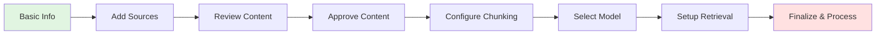

# Knowledge Base Creation Guide

Create intelligent knowledge bases in 7 simple steps. This guide walks you through the entire process from initial setup to deployment-ready KB.

## Prerequisites

Before creating a knowledge base:

- ✅ Active PrivexBot workspace
- ✅ Admin or Editor role
- ✅ Content sources ready (URLs or files)
- ✅ 5-10 minutes for setup

## Creation Workflow



## Step 1: Basic Information

Start by defining your knowledge base fundamentals.

### Configuration Fields

| Field | Required | Description |
|-------|----------|-------------|
| **Name** | ✅ Yes | Unique identifier (3-100 chars) |
| **Description** | ❌ No | Brief overview (max 500 chars) |
| **Context** | ✅ Yes | Usage scope selection |

### Context Options

Choose where your KB will be accessible:

- **🤖 Chatbot Only** - Simple Q&A bots
- **🔄 Chatflow Only** - Complex workflows
- **🌐 Both** - Maximum flexibility (recommended)

### Example Configuration

```json
{
  "name": "Product Documentation KB",
  "description": "Comprehensive API docs and user guides",
  "context": "both"
}
```

:::tip
Choose "Both" for context unless you have specific isolation requirements.
:::

## Step 2: Add Content Sources

Import knowledge from multiple sources simultaneously.

### Source Types

#### 🌐 **Web URLs**

Add single or multiple URLs with crawling configuration:

**Single URL Mode:**
```javascript
// Configuration options
{
  "url": "https://docs.example.com",
  "method": "crawl",        // or "single"
  "max_pages": 50,
  "max_depth": 3,
  "stealth_mode": true,
  "include_patterns": ["/docs/*", "/api/*"],
  "exclude_patterns": ["/blog/*", "/changelog/*"]
}
```

**Bulk URL Mode:**
```javascript
// Add multiple URLs at once
{
  "urls": [
    "https://docs.example.com/guide-1",
    "https://docs.example.com/guide-2",
    "https://docs.example.com/api-reference"
  ],
  "shared_config": {
    "method": "single",
    "stealth_mode": true
  }
}
```

#### 📄 **File Uploads**

Support for 15+ file formats:

| Category | Formats | Features |
|----------|---------|----------|
| **Documents** | PDF, DOCX, ODT, RTF | OCR support for scanned PDFs |
| **Spreadsheets** | XLSX, CSV, ODS | All sheets extracted |
| **Presentations** | PPTX, ODP | Slide content preserved |
| **Text/Data** | TXT, MD, JSON, HTML | Structure maintained |
| **Images** | PNG, JPG, TIFF | OCR text extraction |

**File Size Limits:**
- Maximum file size: 100 MB
- Maximum files per upload: 20
- Minimum content: 50 characters

### Crawl Configuration

| Option | Default | Description |
|--------|---------|-------------|
| `method` | "single" | "single" for one page, "crawl" for site |
| `max_pages` | 50 | Maximum pages to crawl |
| `max_depth` | 3 | Link depth for crawling |
| `stealth_mode` | true | Avoid bot detection |
| `include_patterns` | [] | URL patterns to include |
| `exclude_patterns` | [] | URL patterns to exclude |

## Step 3: Content Review

Review extracted content before processing.

### Source List View

After adding sources, you'll see:

```
📊 Knowledge Sources (4 total)

🌐 https://docs.example.com
   Method: Crawl | Pages: 12 | Status: Ready
   [Preview] [Remove]

📄 product-manual.pdf
   Size: 2.4 MB | Pages: 45 | Status: Parsed
   [Preview] [Remove]
```

### Content Statistics

- Total pages extracted
- Combined word count
- Estimated processing time
- Storage requirements

## Step 4: Content Approval

Critical step for quality control.

### Why Approve Content?

- ✅ Remove irrelevant sections (ads, navigation)
- ✅ Fix extraction errors
- ✅ Edit for clarity
- ✅ Exclude unnecessary pages

### Approval Interface

```
☑️ Select All (12 pages)              [Bulk Actions]

┌─ Page 1: Getting Started Guide ──────────────┐
│ ☑️ Include | Words: 1,234 | Edited: No       │
│                                               │
│ # Getting Started                             │
│ Welcome to our product documentation...       │
│                                               │
│ [Edit Content] [Preview Full]                │
└───────────────────────────────────────────────┘
```

### Editing Content

Click "Edit Content" to modify extracted text:

- Fix formatting issues
- Remove boilerplate text
- Correct OCR errors
- Add clarifications

:::warning Important
Changes are applied during processing. Original content is preserved for reference.
:::

## Step 5: Chunking Configuration

Configure how content is split for optimal retrieval.

### Chunking Strategies

| Strategy | Best For | How It Works |
|----------|----------|--------------|
| **Recursive** (Default) | General content | Hierarchical splitting |
| **By Heading** | Documentation | Splits at # ## ### markers |
| **Semantic** | Diverse topics | AI-powered boundaries |
| **Paragraph** | Articles | Natural paragraph breaks |
| **Sentence** | Chat logs | Fine-grained splits |
| **Adaptive** | Unknown | Auto-selects strategy |
| **Hybrid** | Complex docs | Multi-stage approach |
| **No Chunking** | Small docs | Single chunk per doc |

### Configuration Parameters

```javascript
{
  "strategy": "by_heading",
  "chunk_size": 1000,        // Characters per chunk
  "chunk_overlap": 200,      // Overlap for continuity
  "preserve_code_blocks": true,
  "enable_enhanced_metadata": true
}
```

### Size Guidelines

| Content Type | Chunk Size | Overlap | Strategy |
|--------------|------------|---------|----------|
| API Docs | 1000 | 200 | `by_heading` |
| FAQs | 500-800 | 100 | `semantic` |
| Blog Posts | 800 | 150 | `paragraph_based` |
| Code Repos | 1500 | 300 | `by_heading` |
| User Guides | 1000 | 200 | `by_heading` |

### Estimations

The interface shows real-time estimates:

```
📊 Estimated Results
• ~45 chunks from 15,000 characters
• ~1.5 MB vector storage
• ~2 minutes processing time
```

## Step 6: Model & Vector Configuration

Select embedding model and vector database settings.

### Embedding Models

| Model | Dimensions | Speed | Quality |
|-------|------------|-------|---------|
| **all-MiniLM-L6-v2** ⭐ | 384 | Fast | Good |
| all-MiniLM-L12-v2 | 384 | Medium | Better |
| all-mpnet-base-v2 | 768 | Slow | Best |

### Vector Store Settings

```javascript
{
  "provider": "qdrant",
  "distance_metric": "cosine",  // or "euclidean", "dot"
  "index_settings": {
    "m": 16,                     // HNSW connections
    "ef_construct": 100          // Build quality
  }
}
```

### Performance Considerations

- **CPU vs GPU**: CPU default, GPU for large KBs
- **Batch Size**: 32 (optimal for most cases)
- **Normalization**: Enable for cosine similarity

## Step 7: Retrieval Configuration

Configure how your KB responds to queries.

### Search Strategies

| Strategy | Description | Use Case |
|----------|-------------|----------|
| **Hybrid** ⭐ | Semantic + keyword | Best overall |
| **Semantic** | Pure vector search | Natural language |
| **Keyword** | Traditional matching | Exact terms |
| **MMR** | Diverse results | Avoid redundancy |

### Configuration Options

```javascript
{
  "strategy": "hybrid_search",
  "top_k": 10,              // Results to return (1-50)
  "score_threshold": 0.7,   // Minimum relevance (0-1)
  "rerank_enabled": false   // Coming soon
}
```

### Optimization Tips

| Query Type | Top-K | Threshold | Strategy |
|------------|-------|-----------|----------|
| Precise answers | 3-5 | 0.8 | `semantic` |
| Context gathering | 10-15 | 0.6 | `hybrid` |
| Exploration | 20-30 | 0.5 | `mmr` |

## Step 8: Finalization

Review and create your knowledge base.

### Pre-flight Checklist

✅ **Review Summary:**
- Name and description correct
- All sources added
- Content approved
- Chunking configured
- Models selected
- Retrieval set up

### Processing Pipeline

Once finalized, your KB enters the processing pipeline:


### Processing Times

| Content Size | Typical Time |
|--------------|--------------|
| < 10 pages | 1-2 minutes |
| 10-50 pages | 2-5 minutes |
| 50-100 pages | 5-10 minutes |
| 100+ pages | 10-30 minutes |

### Progress Tracking

Monitor real-time progress:

```
Processing Knowledge Base
████████████████░░░░  75%

Current: Generating embeddings (34/45)

✓ Collection created
✓ Content extracted (10 pages)
✓ Chunks generated (45 total)
◐ Creating embeddings...
○ Indexing vectors
○ Finalizing
```

## Post-Creation

### Verify Your KB

After processing completes:

1. **Test Search** - Run sample queries
2. **Review Chunks** - Check splitting quality
3. **Validate Retrieval** - Ensure accurate results
4. **Connect to Chatbot** - Enable in bot settings

### Management Options

- **🔄 Reindex** - Update with new settings
- **📝 Edit** - Modify name/description
- **🗑️ Archive** - Soft delete
- **📊 Analytics** - View usage stats

## Best Practices

### ✅ **DO's**

- **Start small** - Test with subset first
- **Review content** - Always approve before processing
- **Use appropriate chunks** - Match size to use case
- **Test thoroughly** - Verify retrieval quality
- **Monitor performance** - Track query latency

### ❌ **DON'T's**

- Skip content approval
- Use huge chunk sizes (&gt;2000)
- Mix unrelated content
- Ignore failed sources
- Forget to test retrieval

## Troubleshooting

### Common Issues

| Issue | Cause | Solution |
|-------|-------|----------|
| **Slow processing** | Large files, OCR | Be patient, check progress |
| **Missing content** | Crawler blocked | Use stealth mode |
| **Poor retrieval** | Wrong chunk size | Adjust strategy/size |
| **Timeout errors** | Network issues | Retry with fewer pages |

### Debug Tips

1. Check browser console for errors
2. Review pipeline logs in UI
3. Verify source accessibility
4. Test with smaller dataset
5. Contact support if persistent

## Advanced Features

### Bulk Operations

Process multiple KBs efficiently:

```javascript
// Bulk KB creation via API
const kbs = await Promise.all(
  datasets.map(data =>
    createKnowledgeBase(data)
  )
);
```

### Custom Metadata

Add searchable metadata to chunks:

```javascript
{
  "custom_metadata": {
    "department": "engineering",
    "version": "2.0",
    "tags": ["api", "documentation"]
  }
}
```

### Scheduled Updates

Automate content refresh:

```javascript
{
  "refresh_schedule": "0 0 * * *",  // Daily at midnight
  "auto_approve": false,
  "notification_email": "admin@example.com"
}
```

## Next Steps

- [Chunking Strategies](./chunking-strategies) - Deep dive into splitting algorithms
- [File Uploads](./file-uploads) - Working with documents
- [Retrieval Configuration](./retrieval-configuration) - Optimize search
- [Data Structures](./data-structures) - Architecture details

---

:::tip Success Tip
Most successful KBs use **by_heading** strategy with **1000 char chunks** and **hybrid search**. Start there and optimize based on results.
:::

:::info Processing Note
First-time processing may take longer as models are loaded. Subsequent KBs process faster due to caching.
:::