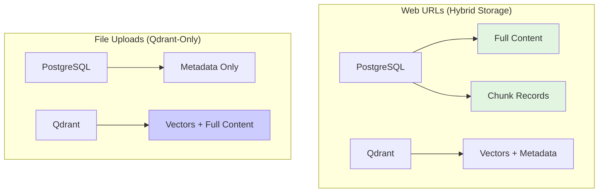
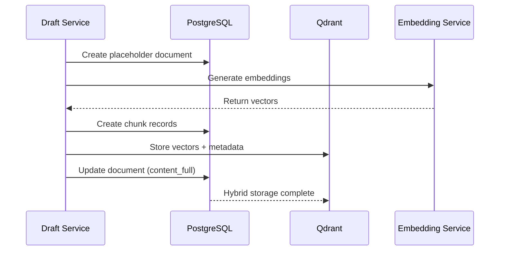
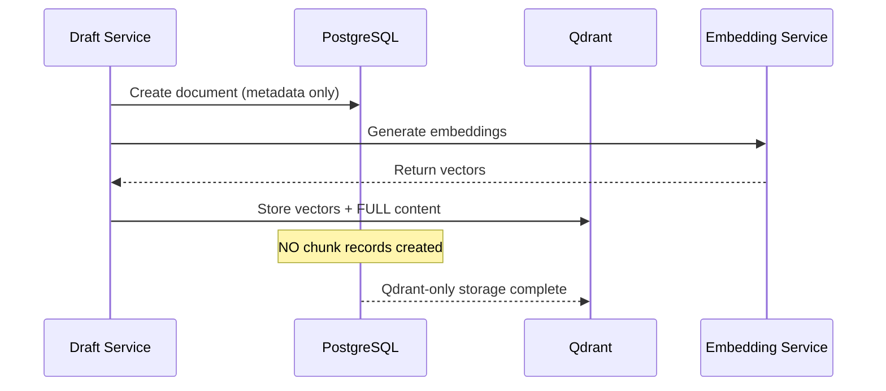
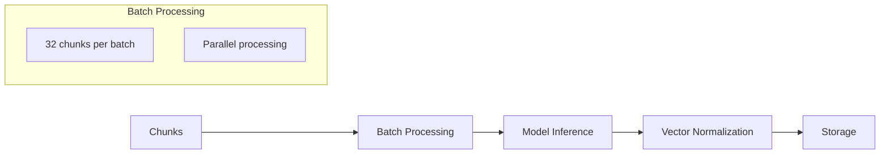

# Knowledge Base Data Structures

Understand the complete data architecture powering PrivexBot Knowledge Bases. From PostgreSQL documents to Qdrant vectors, learn how different source types influence storage strategies and data flow.

## Storage Architecture Overview

PrivexBot employs a **dual storage architecture** with different strategies optimized for different source types:



### Storage Strategy Decision

The system automatically determines storage strategy during processing:

```python
# Decision logic
all_file_uploads = all(s.get("type") == "file_upload" for s in sources)

if all_file_uploads:
    storage_strategy = "qdrant_only"      # Option A
    skip_postgres_chunks = True
else:
    storage_strategy = "hybrid"           # Default
    skip_postgres_chunks = False
```

### Strategy Comparison

| Aspect | Web URLs (Hybrid) | File Uploads (Qdrant-Only) |
|--------|-------------------|---------------------------|
| **PostgreSQL Documents** | Full content stored | Metadata only |
| **PostgreSQL Chunks** | Created and stored | NOT created |
| **Qdrant Vectors** | Stored with metadata | Stored with full content |
| **Content Redundancy** | Content in both stores | Content only in Qdrant |
| **Storage Efficiency** | Higher disk usage | Lower disk usage |
| **Retrieval Speed** | PostgreSQL for quick access | Qdrant payload access |
| **KB Stats** | `storage_type: "hybrid"` | `storage_type: "qdrant_only"` |

## Document Model

### Core Schema

The Document model serves as the primary container for all knowledge sources:

```python
class Document(Base):
    __tablename__ = "documents"

    # Primary identifiers
    id: UUID                          # Auto-generated UUID
    kb_id: UUID                       # Foreign key to knowledge_bases
    workspace_id: UUID                # Multi-tenancy isolation

    # Source information
    name: String(500)                 # Document title/filename
    source_type: String(50)           # "file_upload" | "web_scraping"
    source_url: String(2048)          # Original URL or file:///path
    file_path: String(1024)           # Path for uploaded files

    # Content storage (CRITICAL DIFFERENCE)
    content_full: Text                # Full content (NULL for file uploads)
    content_preview: Text             # First 500 chars (NULL for file uploads)

    # Lifecycle management
    status: String(50)                # "pending" | "processing" | "completed"
    processing_progress: Integer      # 0-100 percentage
    error_message: Text               # Error details if failed

    # Statistics
    word_count: Integer
    character_count: Integer
    page_count: Integer
    chunk_count: Integer

    # Rich metadata (JSONB)
    source_metadata: JSONB            # Source-specific information
    processing_metadata: JSONB        # Processing results
    chunking_config: JSONB            # Per-document chunking override
```

### Document Examples by Source Type

#### Web URL Document

```json
{
  "id": "550e8400-e29b-41d4-a716-446655440000",
  "name": "API Documentation - Page 1",
  "source_type": "web_scraping",
  "source_url": "https://docs.example.com/api",

  "content_full": "# API Documentation\n\nThis is the full scraped content...",
  "content_preview": "# API Documentation\n\nThis is the full...",

  "status": "completed",
  "word_count": 1500,
  "chunk_count": 12,

  "source_metadata": {
    "crawled_at": "2024-12-19T10:30:00Z",
    "page_title": "API Documentation",
    "content_source": "user_approved"
  },

  "processing_metadata": {
    "storage_strategy": "dual_storage",
    "postgres_chunks_created": 12,
    "qdrant_chunks_created": 12
  }
}
```

#### File Upload Document

```json
{
  "id": "550e8400-e29b-41d4-a716-446655440001",
  "name": "Product Manual.pdf",
  "source_type": "file_upload",
  "source_url": "file:///Product Manual.pdf",

  "content_full": null,
  "content_preview": null,

  "status": "completed",
  "word_count": 2500,
  "chunk_count": 18,

  "source_metadata": {
    "original_filename": "Product Manual.pdf",
    "file_size": 2048000,
    "mime_type": "application/pdf",
    "page_count": 15
  },

  "processing_metadata": {
    "storage_strategy": "qdrant_only",
    "postgres_chunks_created": 0,
    "qdrant_chunks_created": 18
  }
}
```

## Chunk Model

### Schema Definition

Chunks represent semantically meaningful pieces of documents:

```python
class Chunk(Base):
    __tablename__ = "chunks"

    # Relationships
    id: UUID                          # Auto-generated UUID
    document_id: UUID                 # Foreign key to documents
    kb_id: UUID                       # Foreign key to knowledge_bases

    # Content
    content: Text                     # Chunk text content
    content_hash: String(64)          # SHA256 for deduplication

    # Positioning
    position: Integer                 # Order within document (0-indexed)
    chunk_index: Integer              # Global chunk number
    page_number: Integer              # For multi-page documents

    # Statistics
    word_count: Integer
    character_count: Integer
    token_count: Integer

    # Embedding (PostgreSQL pgvector)
    embedding: Vector(384)            # 384-dimensional vector
    embedding_metadata: JSONB         # Generation details

    # Rich metadata
    chunk_metadata: JSONB             # Contextual information
    keywords: ARRAY(String)           # Extracted keywords
    quality_score: Float              # 0-1 quality ranking
```

### Chunk Creation by Storage Strategy

#### Web URL Chunks (PostgreSQL + Qdrant)

For web scraping sources, chunks are stored in **both** PostgreSQL and Qdrant:

```json
{
  "id": "880e8400-e29b-41d4-a716-446655440000",
  "content": "## Authentication\n\nTo authenticate with the API...",
  "position": 3,
  "word_count": 180,
  "character_count": 1050,
  "token_count": 262,

  "embedding": [0.0234, -0.0567, 0.0891, ...],

  "chunk_metadata": {
    "strategy": "by_heading",
    "parent_heading": "## Authentication",
    "heading_level": 2,
    "context_before": "...previous chunk ending...",
    "context_after": "...next chunk beginning...",
    "enhanced_metadata_enabled": true
  }
}
```

#### File Upload Chunks (Qdrant Only)

For file uploads, **no PostgreSQL chunk records** are created. All content exists in Qdrant payloads.

## Vector Storage (Qdrant)

### Collection Structure

Each Knowledge Base gets its own Qdrant collection:

```python
# Collection naming
collection_name = f"kb_{str(kb_id).replace('-', '_')}"
# Example: kb_660e8400_e29b_41d4_a716_446655440111

# Vector configuration
vectors_config = models.VectorParams(
    size=384,                              # Dimensions
    distance=models.Distance.COSINE        # Similarity metric
)

# HNSW index parameters
hnsw_config = models.HnswConfigDiff(
    m=16,                                  # Connections per node
    ef_construct=100                       # Construction accuracy
)
```

### Point Structure

Each chunk becomes a vector point:

```python
PointStruct(
    id="880e8400-e29b-41d4-a716-446655440000",  # Chunk UUID
    vector=[0.0234, -0.0567, 0.0891, ...],      # 384 floats
    payload={...}                                # Rich metadata + content
)
```

### Payload Differences by Source Type

#### Web URL Payload

```json
{
  "content": "## Authentication\n\nTo authenticate with the API...",

  "document_id": "550e8400-e29b-41d4-a716-446655440000",
  "source_type": "web_scraping",
  "source_url": "https://docs.example.com/api",
  "page_url": "https://docs.example.com/api#authentication",

  "chunk_index": 3,
  "chunking_strategy": "by_heading",
  "storage_location": "qdrant_and_postgres",

  "parent_heading": "## Authentication",
  "section_title": "Authentication",
  "context_before": "...previous section...",
  "context_after": "...next section..."
}
```

#### File Upload Payload

```json
{
  "content": "Chapter 3: Product Features\n\nOur product offers...",

  "document_id": "550e8400-e29b-41d4-a716-446655440001",
  "source_type": "file_upload",
  "original_filename": "Product Manual.pdf",
  "page_url": "file:///Product Manual.pdf",

  "chunk_index": 5,
  "chunking_strategy": "by_heading",
  "storage_location": "qdrant_only",

  "parent_heading": "Chapter 3: Product Features",
  "section_title": "Product Features"
}
```

## Data Flow by Source Type

### Web URL Flow



**Key Points:**
- Content stored in **both** PostgreSQL and Qdrant
- PostgreSQL chunks enable quick access and editing
- Qdrant provides semantic search capabilities
- Full content redundancy for reliability

### File Upload Flow



**Key Points:**
- Content stored **only** in Qdrant
- PostgreSQL contains metadata only
- No chunk table records created
- Space-efficient storage strategy

## Chunking Strategy Impact

Different chunking strategies create varying data structures:

### Strategy Comparison

| Strategy | Chunks Created | Metadata Richness | Performance |
|----------|---------------|-------------------|-------------|
| **no_chunking** | 1 (entire doc) | Minimal | Fastest |
| **recursive** | 10-20 | Basic | Fast |
| **by_heading** | 8-12 | Rich structure | Medium |
| **semantic** | 6-10 | Topic boundaries | Slow |
| **adaptive** | 8-15 | Auto-analysis | Medium |

### Metadata by Strategy

#### By Heading Strategy

```json
{
  "chunk_metadata": {
    "strategy": "by_heading",
    "parent_heading": "## Authentication",
    "heading_level": 2,
    "section_title": "Authentication",
    "context_before": "...end of previous section...",
    "context_after": "...start of next section..."
  }
}
```

#### Semantic Strategy

```json
{
  "chunk_metadata": {
    "strategy": "semantic",
    "semantic_threshold": 0.65,
    "grouped_paragraphs": 3,
    "similarity_to_next": 0.42
  }
}
```

#### Adaptive Strategy

```json
{
  "chunk_metadata": {
    "strategy": "adaptive",
    "adaptive_suggestion": "by_heading",
    "reasoning": "High heading density (6.00%)",
    "document_analysis": {
      "heading_count": 12,
      "heading_density": 0.06,
      "recommended_strategy": "by_heading"
    }
  }
}
```

## Embedding Architecture

### Model Configuration

| Model | Dimensions | Speed | Quality | Use Case |
|-------|------------|-------|---------|----------|
| **all-MiniLM-L6-v2** | 384 | Fast | Good | Default choice |
| all-MiniLM-L12-v2 | 384 | Medium | Better | Quality-focused |
| all-mpnet-base-v2 | 768 | Slow | Best | Research/accuracy |

### Generation Process



### Embedding Metadata

```json
{
  "embedding_metadata": {
    "model": "all-MiniLM-L6-v2",
    "provider": "sentence_transformers",
    "dimensions": 384,
    "generated_at": "2024-12-19T10:32:00Z",
    "generation_time_ms": 45,
    "normalized": true
  }
}
```

## Query Performance

### Search Strategies

| Strategy | Data Sources | Speed | Accuracy |
|----------|-------------|-------|----------|
| **Hybrid** | PostgreSQL + Qdrant | Medium | High |
| **Semantic** | Qdrant only | Fast | High |
| **Keyword** | PostgreSQL only | Fastest | Medium |

### Filterable Fields

Common Qdrant payload filters:

```javascript
{
  "kb_id": "660e8400-e29b-41d4-a716-446655440111",
  "workspace_id": "770e8400-e29b-41d4-a716-446655440222",
  "source_type": "web_scraping",
  "chunking_strategy": "by_heading",
  "word_count": {"gte": 100}
}
```

## Best Practices

### Storage Strategy Selection

**Choose Hybrid (Web URLs) when:**
- Content may need updates
- Quick PostgreSQL access required
- Full-text search needed
- Content editing capabilities desired

**Choose Qdrant-Only (Files) when:**
- Content is immutable
- Space efficiency important
- Files are the primary source
- Vector search is sufficient

### Performance Optimization

| Aspect | Recommendation | Impact |
|--------|----------------|--------|
| **Chunk Size** | 800-1200 characters | Optimal retrieval |
| **Overlap** | 10-20% of chunk size | Context preservation |
| **Strategy** | by_heading for docs | Natural boundaries |
| **Metadata** | Enable enhanced only when needed | Reduced storage |

### Monitoring

Track these key metrics:

```javascript
{
  "storage_efficiency": {
    "total_documents": 150,
    "total_chunks": 2400,
    "postgres_chunks": 1200,
    "qdrant_points": 2400,
    "storage_type_breakdown": {
      "hybrid": 75,
      "qdrant_only": 75
    }
  }
}
```

## Next Steps

- [Creation Guide](./creation-guide) - Complete KB creation workflow
- [Chunking Strategies](./chunking-strategies) - Optimize content splitting
- [File Uploads](./file-uploads) - Working with documents
- [Retrieval Configuration](./retrieval-configuration) - Search optimization

---

:::tip Storage Efficiency
File-only KBs use 40-60% less storage than mixed KBs due to the qdrant-only strategy avoiding content duplication.
:::

:::info Implementation Note
The dual storage architecture ensures optimal performance for different access patterns while maintaining data consistency across storage systems.
:::