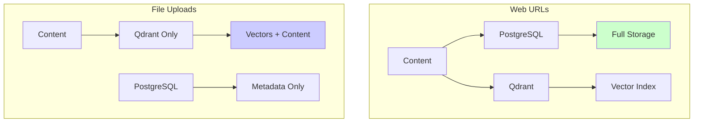
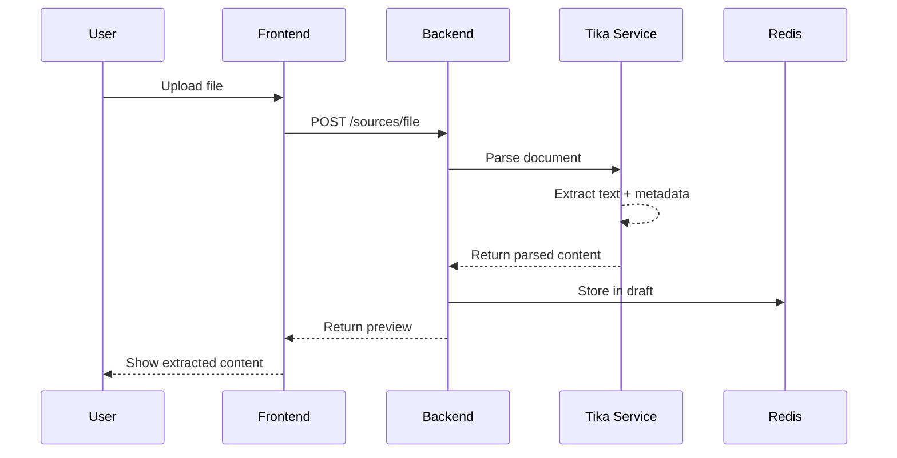
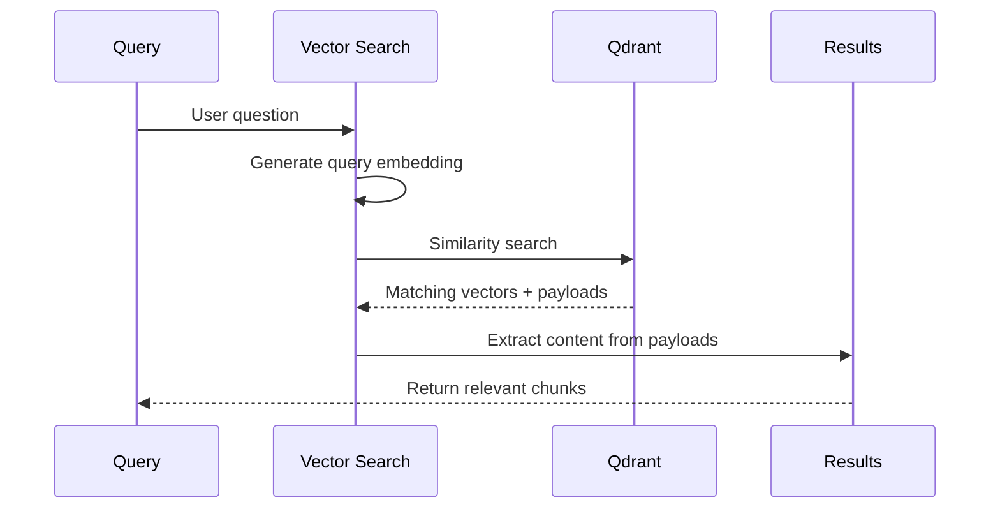

# File Upload Guide

Transform your documents into searchable knowledge. PrivexBot supports 15+ file formats with intelligent parsing and OCR capabilities.

## Supported Formats

### Document Formats

| Format | Extensions | OCR Support | Notes |
|--------|-----------|-------------|-------|
| **PDF** | `.pdf` | ✅ Yes | Scanned PDFs automatically use OCR |
| **Microsoft Word** | `.doc`, `.docx` | ❌ No | Full formatting preserved |
| **OpenDocument Text** | `.odt` | ❌ No | LibreOffice/OpenOffice format |
| **Rich Text** | `.rtf` | ❌ No | Cross-platform compatibility |
| **Plain Text** | `.txt` | ❌ No | UTF-8 encoding supported |
| **Markdown** | `.md` | ❌ No | Structure preserved |

### Spreadsheet Formats

| Format | Extensions | Processing | Notes |
|--------|-----------|------------|-------|
| **Excel** | `.xls`, `.xlsx` | All sheets | Formulas converted to values |
| **CSV** | `.csv` | Auto-detect delimiter | Headers preserved |
| **OpenDocument** | `.ods` | All sheets | LibreOffice Calc format |
| **TSV** | `.tsv` | Tab-separated | Similar to CSV |

### Presentation Formats

| Format | Extensions | Content Extracted | Notes |
|--------|-----------|-------------------|-------|
| **PowerPoint** | `.ppt`, `.pptx` | Slide text, notes | Speaker notes included |
| **OpenDocument** | `.odp` | All text content | LibreOffice Impress |
| **Google Slides** | Export as `.pptx` | Full content | Via export |

### Data & Code Formats

| Format | Extensions | Processing | Notes |
|--------|-----------|------------|-------|
| **JSON** | `.json` | Pretty-printed | Structure preserved |
| **XML** | `.xml` | Text extracted | Tags removed |
| **HTML** | `.html`, `.htm` | Clean text | Scripts/styles removed |
| **YAML** | `.yaml`, `.yml` | Converted to text | Comments preserved |

### Image Formats (OCR)

| Format | Extensions | OCR Quality | Notes |
|--------|-----------|-------------|-------|
| **PNG** | `.png` | ⭐⭐⭐⭐⭐ | Best for screenshots |
| **JPEG** | `.jpg`, `.jpeg` | ⭐⭐⭐⭐ | Good for photos |
| **TIFF** | `.tiff`, `.tif` | ⭐⭐⭐⭐⭐ | High quality scans |
| **BMP** | `.bmp` | ⭐⭐⭐ | Uncompressed |

## File Processing Architecture

### Storage Strategy Comparison



### Why Different Storage?

| Aspect | Web URLs | File Uploads |
|--------|----------|--------------|
| **Content Storage** | PostgreSQL + Qdrant | Qdrant only |
| **Reindexing** | ✅ Supported | ❌ Not supported |
| **Privacy** | Standard | Enhanced (no DB storage) |
| **Storage Efficiency** | Lower | Higher |
| **Content Access** | Direct from DB | Via vector search |

## Upload Process

### Step 1: File Selection

#### Drag & Drop Interface

```typescript
// React component for file upload
<DropZone
  accept={{
    'application/pdf': ['.pdf'],
    'application/msword': ['.doc'],
    'application/vnd.openxmlformats-officedocument.wordprocessingml.document': ['.docx'],
    'text/csv': ['.csv'],
    // ... more formats
  }}
  maxSize={100 * 1024 * 1024}  // 100MB
  maxFiles={20}
  onDrop={handleFiles}
/>
```

#### File Validation

```javascript
// Pre-upload validation
const validateFile = (file) => {
  const checks = {
    size: file.size <= MAX_FILE_SIZE,
    type: SUPPORTED_TYPES.includes(file.type),
    name: !file.name.includes('..'),
    extension: hasValidExtension(file.name)
  };

  return {
    valid: Object.values(checks).every(Boolean),
    errors: getValidationErrors(checks)
  };
};
```

### Step 2: Complexity Analysis

Files are analyzed before upload to estimate processing time:

#### Complexity Factors

| Factor | Impact | Calculation |
|--------|--------|-------------|
| **File Size** | Linear | +30s per MB |
| **File Type** | Multiplier | PDF: 3x, TXT: 1x |
| **OCR Required** | Major | 5-10x slower |
| **Page Count** | Linear | +2s per page |

#### Complexity Indicators

```javascript
function getComplexityIndicator(file) {
  const complexity = analyzeComplexity(file);

  return {
    low: { color: 'green', time: '&lt;30s', icon: '🟢' },
    medium: { color: 'yellow', time: '30s-2m', icon: '🟡' },
    high: { color: 'orange', time: '2-5m', icon: '🟠' },
    veryHigh: { color: 'red', time: '&gt;5m', icon: '🔴' }
  }[complexity.level];
}
```

### Step 3: Apache Tika Processing

PrivexBot uses Apache Tika for robust file parsing:

#### Processing Pipeline



#### Tika Configuration

```python
class TikaConfig:
    # Timeouts (adaptive based on file)
    base_timeout = 30  # seconds
    timeout_per_100kb = 1.0
    ocr_multiplier = 3.0
    max_timeout = 600  # 10 minutes

    # OCR Settings
    ocr_enabled = True
    ocr_languages = ['eng', 'fra', 'deu', 'spa']
    ocr_strategy = 'auto'  # auto, always, never

    # Processing
    max_file_size_mb = 100
    extract_metadata = True
    preserve_formatting = False
```

#### Timeout Calculation

```python
def calculate_timeout(file_size_bytes, mime_type):
    """Adaptive timeout based on file characteristics."""

    base = 30  # seconds
    size_factor = (file_size_bytes / 102400) * 1  # +1s per 100KB

    # OCR multiplier for images and scanned PDFs
    if requires_ocr(mime_type):
        ocr_factor = 3.0
    else:
        ocr_factor = 1.0

    # Large file bonus
    if file_size_bytes > 10_000_000:  # 10MB
        large_bonus = 60
    else:
        large_bonus = 0

    timeout = (base + size_factor) * ocr_factor + large_bonus
    return min(timeout, 600)  # Cap at 10 minutes
```

## Content Extraction

### PDF Processing

#### Text PDFs vs Scanned PDFs

| Type | Detection | Processing | Speed |
|------|-----------|------------|-------|
| **Text PDF** | Has selectable text | Direct extraction | Fast (5-10s) |
| **Scanned PDF** | Image-only pages | OCR required | Slow (30s-5m) |
| **Mixed PDF** | Some text, some images | Hybrid approach | Medium |

#### OCR Quality Factors

```python
# OCR quality depends on:
quality_factors = {
    'resolution': 'min 300 DPI',
    'contrast': 'high black/white',
    'rotation': 'correct orientation',
    'language': 'known language set',
    'font': 'standard fonts better'
}
```

### Spreadsheet Processing

#### Multi-Sheet Handling

```python
# Excel/ODS files with multiple sheets
for sheet in workbook.sheets:
    content += f"\n\n=== Sheet: {sheet.name} ===\n"
    content += extract_sheet_content(sheet)
```

#### CSV Parsing

```python
# Intelligent delimiter detection
delimiters = [',', ';', '\t', '|']
detected = detect_delimiter(sample_lines)

# Parse with pandas
df = pd.read_csv(file, delimiter=detected)
content = df.to_markdown()
```

### Document Processing

#### Preserving Structure

```python
# Maintain document hierarchy
def extract_with_structure(document):
    content = []

    for element in document.elements:
        if element.is_heading:
            level = '#' * element.level
            content.append(f"{level} {element.text}")
        elif element.is_list:
            for item in element.items:
                content.append(f"- {item}")
        else:
            content.append(element.text)

    return '\n'.join(content)
```

## Content Approval

### Review Interface

After parsing, review extracted content:

```
┌─────────────────────────────────────────┐
│ Extracted Content - product-manual.pdf  │
├─────────────────────────────────────────┤
│ Pages: 45 | Words: 12,450 | Size: 2.4MB │
│                                         │
│ ☑ Page 1: Introduction                 │
│ ☑ Page 2: Getting Started              │
│ ☐ Page 3: Legal Notice (exclude)       │
│ ☑ Page 4: Installation                 │
│                                         │
│ [Select All] [Deselect All] [Invert]   │
└─────────────────────────────────────────┘
```

### Editing Extracted Text

Fix OCR errors or formatting issues:

```javascript
// Edit interface for each page
const EditDialog = ({ page, onSave }) => {
  const [content, setContent] = useState(page.content);

  return (
    <Dialog>
      <TextArea
        value={content}
        onChange={setContent}
        rows={20}
      />
      <Button onClick={() => onSave(content)}>
        Save Changes
      </Button>
    </Dialog>
  );
};
```

## Chunking Considerations

### Recommended Strategies by File Type

| File Type | Strategy | Chunk Size | Reasoning |
|-----------|----------|------------|-----------|
| **PDF Manual** | `by_heading` | 1000 | Usually has clear sections |
| **CSV Data** | `recursive` | 500 | Tabular data needs context |
| **Word Docs** | `paragraph_based` | 800 | Natural paragraph breaks |
| **Code Files** | `by_heading` | 1500 | Preserve functions/classes |
| **Scanned Images** | `semantic` | 600 | OCR may lack structure |

### Special Considerations

#### Tables in Documents

```javascript
// Table detection and preservation
{
  "preserve_tables": true,
  "table_strategy": "keep_intact",  // or "split_rows"
  "max_table_size": 2000
}
```

#### Code in Documents

```javascript
// Code block handling
{
  "preserve_code_blocks": true,
  "code_language_detection": true,
  "syntax_aware_splitting": false
}
```

## Storage & Retrieval

### Qdrant-Only Storage Model

For file uploads, content exists only in Qdrant:

```python
# No PostgreSQL content storage
document.content_full = None  # Always null for uploads
document.content_preview = None

# Everything in Qdrant payload
qdrant_point = {
    "id": chunk_id,
    "vector": embedding,
    "payload": {
        "content": full_chunk_text,  # Full content here
        "document_id": document.id,
        "metadata": {...}
    }
}
```

### Retrieval Process



## Best Practices

### ✅ **DO's**

#### File Preparation
- **Optimize PDFs** before upload (compress, OCR)
- **Use clear filenames** for easy identification
- **Check file size** - split very large files
- **Test with samples** before bulk upload
- **Review OCR output** for accuracy

#### Processing
- **Batch similar files** together
- **Use appropriate chunk sizes** for content type
- **Enable metadata extraction** for context
- **Approve content** before finalization
- **Monitor processing** progress

### ❌ **DON'T's**

- Upload password-protected files
- Mix unrelated content in one KB
- Skip content review for OCR files
- Use very small chunks for tables
- Upload files &gt;100MB without splitting

## Performance Optimization

### Upload Speed Tips

```javascript
// Parallel uploads for multiple files
const uploadFiles = async (files) => {
  const chunks = chunkArray(files, 3);  // 3 parallel

  for (const chunk of chunks) {
    await Promise.all(
      chunk.map(file => uploadSingleFile(file))
    );
  }
};
```

### Processing Time Estimates

| File Size | Type | OCR | Estimated Time |
|-----------|------|-----|----------------|
| &lt;1MB | TXT | No | 5-10 seconds |
| &lt;5MB | PDF | No | 10-30 seconds |
| &lt;10MB | PDF | Yes | 1-3 minutes |
| &lt;50MB | PDF | Yes | 3-10 minutes |
| &lt;100MB | Any | Yes | 5-15 minutes |

## Troubleshooting

### Common Issues

| Issue | Cause | Solution |
|-------|-------|----------|
| **Timeout errors** | Large file, slow OCR | Increase timeout, split file |
| **Missing content** | Failed OCR | Check image quality, retry |
| **Garbled text** | Wrong encoding | Ensure UTF-8, check language |
| **Incomplete extraction** | Parser error | Try different format, contact support |
| **Memory errors** | File too large | Split into smaller files |

### OCR Issues

#### Poor OCR Quality

**Symptoms:**
- Garbled characters
- Missing words
- Incorrect formatting

**Solutions:**
1. Improve source quality (scan at 300+ DPI)
2. Pre-process images (contrast, rotation)
3. Specify correct language
4. Use PDF text layer if available

#### OCR Timeout

**Symptoms:**
- Processing stuck
- Timeout after 10 minutes

**Solutions:**
1. Split PDF into smaller parts
2. Reduce image resolution
3. Process during off-peak hours
4. Contact support for large batches

## API Reference

### Upload Endpoint

```bash
POST /api/v1/kb-drafts/{draft_id}/sources/file
Content-Type: multipart/form-data

Parameters:
- file: Binary file data
- config: Optional processing configuration
```

### Python Example

```python
import requests

def upload_file_to_kb(draft_id, file_path):
    with open(file_path, 'rb') as f:
        files = {'file': f}
        response = requests.post(
            f'https://api.privexbot.com/v1/kb-drafts/{draft_id}/sources/file',
            files=files,
            headers={'Authorization': 'Bearer YOUR_TOKEN'}
        )
    return response.json()
```

### JavaScript Example

```javascript
async function uploadFile(draftId, file) {
  const formData = new FormData();
  formData.append('file', file);

  const response = await fetch(
    `/api/v1/kb-drafts/${draftId}/sources/file`,
    {
      method: 'POST',
      body: formData,
      headers: {
        'Authorization': 'Bearer YOUR_TOKEN'
      }
    }
  );

  return response.json();
}
```

## Next Steps

- [Chunking Strategies](./chunking-strategies) - Optimize for your content
- [Retrieval Configuration](./retrieval-configuration) - Fine-tune search
- [Retrieval Configuration](./retrieval-configuration) - Search optimization
- [Data Structures](./data-structures) - Architecture details

---

:::tip Processing Tip
For best results with scanned PDFs, ensure they're scanned at **300 DPI or higher** with good contrast. This dramatically improves OCR accuracy.
:::

:::warning Size Limit
Files larger than 100MB should be split before upload. Use PDF splitting tools or process documents in sections for optimal performance.
:::

:::info Privacy Note
File content is stored **only in Qdrant** (not PostgreSQL) for enhanced privacy. This means content can only be accessed through vector search, not direct database queries.
:::