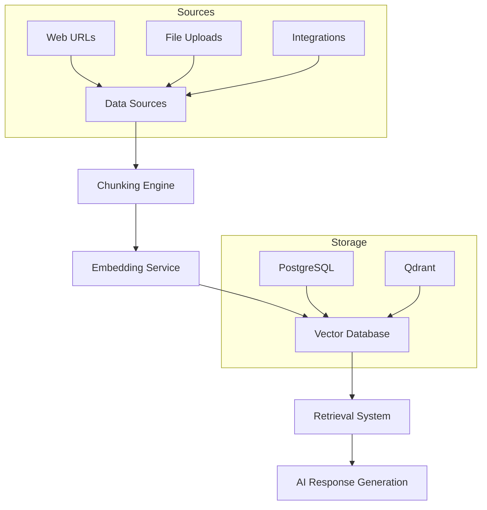
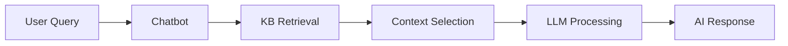

# Knowledge Base Overview

Transform your chatbots into intelligent assistants powered by domain-specific knowledge. PrivexBot's Knowledge Base system enables Retrieval-Augmented Generation (RAG) for accurate, contextual responses.

## What is a Knowledge Base?

A Knowledge Base (KB) in PrivexBot is a structured collection of information that:

- **Empowers AI chatbots** with specialized knowledge
- **Enables semantic search** through vector embeddings
- **Provides contextual responses** using RAG technology
- **Supports multiple sources** including websites, files, and integrations

## Architecture at a Glance



## Key Features

### 🌐 **Multi-Source Support**

Import knowledge from various sources:

- **Web Scraping**: Crawl websites and documentation
- **File Uploads**: Support for 15+ file formats (PDF, DOCX, CSV, etc.)
- **Integrations**: Connect to Google Docs, Notion (coming soon)

### 🧠 **Intelligent Chunking**

Advanced content splitting strategies:

- **Adaptive**: Auto-selects optimal strategy
- **Semantic**: AI-powered topic detection
- **Structural**: By headings, paragraphs, or sentences
- **Custom**: Define your own patterns

### 🔍 **Powerful Retrieval**

Flexible search strategies:

- **Hybrid Search**: Combines semantic + keyword matching
- **Semantic Search**: Pure vector similarity
- **MMR**: Maximal Marginal Relevance for diversity
- **Threshold Filtering**: Minimum relevance scores

### 🔐 **Privacy-First Design**

- **Qdrant-only storage** for file uploads
- **Content approval** before processing
- **Workspace isolation** for multi-tenancy
- **Role-based access control**

## Core Components

### 1. **Chunking Service**

Splits documents into semantically meaningful pieces optimized for retrieval.

**Key Strategies:**

- `recursive` - Default hierarchical splitting
- `by_heading` - Structure-aware for documentation
- `semantic` - AI-powered topic boundaries
- `adaptive` - Auto-selects based on content

[Learn more about chunking →](./chunking-strategies)

### 2. **Embedding Service**

Generates high-quality vector representations using state-of-the-art models.

**Default Model:** `all-MiniLM-L6-v2`

- 384 dimensions
- Fast processing
- Excellent quality-to-speed ratio

[Learn more about embeddings →](./data-structures)

### 3. **Vector Database (Qdrant)**

High-performance vector similarity search engine.

**Features:**

- HNSW indexing for fast retrieval
- Cosine similarity matching
- Metadata filtering
- Scalable to millions of vectors

[Learn more about vector storage →](./data-structures)

### 4. **Retrieval System**

Intelligent content retrieval for optimal context selection.

**Strategies:**

- Hybrid search (semantic + keyword)
- Top-K result ranking
- Score threshold filtering
- Re-ranking (coming soon)

[Learn more about retrieval →](./retrieval-configuration)

## Storage Architecture

PrivexBot uses a **dual storage architecture** optimized for different source types:

### Web URLs (Hybrid Storage)

```
PostgreSQL          +        Qdrant
├─ Full content            ├─ Vectors
├─ Chunk records           ├─ Metadata
└─ Quick access            └─ Semantic search
```

### File Uploads (Qdrant-Only)

```
PostgreSQL          +        Qdrant
├─ Metadata only           ├─ Vectors
├─ No content              ├─ Full content
└─ Management              └─ Primary storage
```

## Creation Workflow

The KB creation process follows a structured 7-step workflow:

1. **Basic Information** - Name, description, context
2. **Content Sources** - Add URLs or upload files
3. **Content Approval** - Review and edit extracted content
4. **Chunking Config** - Select splitting strategy
5. **Model Selection** - Choose embedding model
6. **Retrieval Setup** - Configure search parameters
7. **Finalization** - Create and process KB

[View complete creation guide →](./creation-guide)

## Performance Guidelines

### Optimal Chunk Sizes

| Use Case          | Size            | Overlap | Strategy          |
| ----------------- | --------------- | ------- | ----------------- |
| **Chatbots**      | 600-800 chars   | 100     | `semantic`        |
| **Documentation** | 1000-1200 chars | 200     | `by_heading`      |
| **FAQs**          | 400-600 chars   | 50      | `paragraph_based` |
| **Complex Docs**  | 1200-1500 chars | 250     | `hybrid`          |

### Processing Times

| Content Size | Processing Time | Vectors Created |
| ------------ | --------------- | --------------- |
| 10 pages     | 1-2 minutes     | ~50 vectors     |
| 50 pages     | 3-5 minutes     | ~250 vectors    |
| 100 pages    | 5-10 minutes    | ~500 vectors    |
| 500 pages    | 15-30 minutes   | ~2500 vectors   |

## Best Practices

### ✅ **DO**

- **Review content** before processing
- **Choose appropriate chunk sizes** for your use case
- **Use semantic chunking** for diverse content
- **Enable code block preservation** for technical docs
- **Test retrieval** before deploying to production

### ❌ **DON'T**

- Create chunks larger than 2000 characters
- Skip content approval for scraped pages
- Mix unrelated content in one KB
- Use `no_chunking` for large documents
- Ignore retrieval score thresholds

## Integration with Chatbots

Knowledge Bases seamlessly integrate with PrivexBot chatbots:



### Configuration Options

- **Context**: Chatbot-only, Chatflow-only, or Both
- **Top-K Results**: Number of chunks to retrieve (1-50)
- **Score Threshold**: Minimum relevance (0.0-1.0)
- **Search Strategy**: Semantic, Hybrid, or Keyword

## Monitoring & Maintenance

### KB Health Metrics

- Total documents and chunks
- Average retrieval latency
- Query success rate
- Storage utilization

### Maintenance Tasks

- **Reindexing**: Update embeddings with new models
- **Content refresh**: Re-crawl web sources
- **Optimization**: Adjust chunk sizes based on performance
- **Cleanup**: Remove outdated or unused KBs

## Security & Privacy

### Data Protection

- **Encryption**: At rest and in transit
- **Isolation**: Workspace-level separation
- **Access Control**: Role-based permissions
- **Audit Logging**: Track all operations

### Compliance

- GDPR-ready data handling
- Right to deletion support
- Data portability features
- Privacy-first architecture

## Next Steps

import DocGrid from '@site/src/components/DocGrid';
import DocCard from '@site/src/components/DocCard';

<DocGrid
title="Start Building Your Knowledge Base"
subtitle="Explore comprehensive guides to master PrivexBot's Knowledge Base system"
columns={3}

> <DocCard

    title="Creation Guide"
    description="Complete step-by-step workflow for creating knowledge bases with web scraping, file uploads, and content optimization."
    href="./creation-guide"
    difficulty="Beginner"
    tags={["Getting Started", "Setup"]}
    icon={
      <svg viewBox="0 0 24 24" fill="none" xmlns="http://www.w3.org/2000/svg">
        <path d="M12 2L3 7V12C3 16.55 6.84 20.74 9.91 21.36C11.27 21.61 12.73 21.61 14.09 21.36C17.16 20.74 21 16.55 21 12V7L12 2Z" stroke="currentColor" strokeWidth="2" strokeLinecap="round" strokeLinejoin="round"/>
        <path d="M9 12L11 14L15 10" stroke="currentColor" strokeWidth="2" strokeLinecap="round" strokeLinejoin="round"/>
      </svg>
    }

/>

<DocCard
title="Chunking Strategies"
description="Master advanced text splitting algorithms including semantic, recursive, and adaptive chunking for optimal retrieval performance."
href="./chunking-strategies"
difficulty="Intermediate"
tags={["Algorithms", "Performance"]}
icon={
<svg viewBox="0 0 24 24" fill="none" xmlns="http://www.w3.org/2000/svg">
<path d="M4 6C4 4.89543 4.89543 4 6 4H8C9.10457 4 10 4.89543 10 6V8C10 9.10457 9.10457 10 8 10H6C4.89543 10 4 9.10457 4 8V6Z" stroke="currentColor" strokeWidth="2"/>
<path d="M14 6C14 4.89543 14.8954 4 16 4H18C19.1046 4 20 4.89543 20 6V8C20 9.10457 19.1046 10 18 10H16C14.8954 10 14 9.10457 14 8V6Z" stroke="currentColor" strokeWidth="2"/>
<path d="M4 16C4 14.8954 4.89543 14 6 14H8C9.10457 14 10 14.8954 10 16V18C10 19.1046 9.10457 20 8 20H6C4.89543 20 4 19.1046 4 18V16Z" stroke="currentColor" strokeWidth="2"/>
<path d="M14 16C14 14.8954 14.8954 14 16 14H18C19.1046 14 20 14.8954 20 16V18C20 19.1046 19.1046 20 18 20H16C14.8954 20 14 19.1046 14 18V16Z" stroke="currentColor" strokeWidth="2"/>
</svg>
}
/>

<DocCard
title="File Upload Guide"
description="Process 15+ file formats with intelligent parsing, OCR capabilities, and Apache Tika integration for comprehensive document handling."
href="./file-uploads"
difficulty="Intermediate"
tags={["File Processing", "OCR"]}
icon={
<svg viewBox="0 0 24 24" fill="none" xmlns="http://www.w3.org/2000/svg">
<path d="M14 2H6C4.89543 2 4 2.89543 4 4V20C4 21.1046 4.89543 22 6 22H18C19.1046 22 20 21.1046 20 20V8L14 2Z" stroke="currentColor" strokeWidth="2" strokeLinecap="round" strokeLinejoin="round"/>
<path d="M14 2V8H20" stroke="currentColor" strokeWidth="2" strokeLinecap="round" strokeLinejoin="round"/>
<path d="M16 13H8" stroke="currentColor" strokeWidth="2" strokeLinecap="round" strokeLinejoin="round"/>
<path d="M16 17H8" stroke="currentColor" strokeWidth="2" strokeLinecap="round" strokeLinejoin="round"/>
<path d="M10 9H9H8" stroke="currentColor" strokeWidth="2" strokeLinecap="round" strokeLinejoin="round"/>
</svg>
}
/>

<DocCard
title="Retrieval Configuration"
description="Fine-tune search strategies with hybrid, semantic, and MMR approaches. Optimize precision and performance for your specific use case."
href="./retrieval-configuration"
difficulty="Advanced"
tags={["Search", "Optimization"]}
icon={
<svg viewBox="0 0 24 24" fill="none" xmlns="http://www.w3.org/2000/svg">
<circle cx="11" cy="11" r="8" stroke="currentColor" strokeWidth="2"/>
<path d="M21 21L16.65 16.65" stroke="currentColor" strokeWidth="2" strokeLinecap="round" strokeLinejoin="round"/>
<path d="M11 6V16" stroke="currentColor" strokeWidth="2" strokeLinecap="round" strokeLinejoin="round"/>
<path d="M6 11H16" stroke="currentColor" strokeWidth="2" strokeLinecap="round" strokeLinejoin="round"/>
</svg>
}
/>

<DocCard
title="Data Structures"
description="Deep dive into PostgreSQL documents, Qdrant vectors, dual storage architecture, and the complete data flow for both source types."
href="./data-structures"
difficulty="Advanced"
tags={["Architecture", "Database"]}
icon={
<svg viewBox="0 0 24 24" fill="none" xmlns="http://www.w3.org/2000/svg">
<ellipse cx="12" cy="5" rx="9" ry="3" stroke="currentColor" strokeWidth="2"/>
<path d="M21 12C21 13.66 16.97 15 12 15S3 13.66 3 12" stroke="currentColor" strokeWidth="2"/>
<path d="M3 5V19C3 20.66 7.03 22 12 22S21 20.66 21 19V5" stroke="currentColor" strokeWidth="2"/>
<path d="M3 12V19C3 20.66 7.03 22 12 22S21 20.66 21 19V12" stroke="currentColor" strokeWidth="2"/>
</svg>
}
/>

</DocGrid>

---

:::tip Pro Tip
Start with the **adaptive chunking strategy** if you're unsure which to use. It automatically analyzes your content and selects the optimal approach.
:::

:::info
Knowledge Bases are available on all PrivexBot plans. Enterprise plans include advanced features like custom embedding models and unlimited storage.
:::
