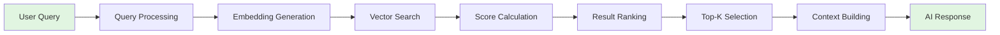

# Retrieval Configuration

Configure intelligent search strategies to deliver precise, contextual responses. The right retrieval configuration ensures your chatbot finds the most relevant information quickly and accurately.

## Search Strategies Overview

### Strategy Comparison

| Strategy | Algorithm | Best For | Speed | Accuracy |
|----------|-----------|----------|-------|----------|
| **Hybrid Search** ⭐ | Semantic + Keyword | General use | ⭐⭐⭐⭐ | ⭐⭐⭐⭐⭐ |
| **Semantic Search** | Vector similarity | Natural language | ⭐⭐⭐⭐⭐ | ⭐⭐⭐⭐ |
| **Keyword Search** | Term matching | Exact phrases | ⭐⭐⭐⭐⭐ | ⭐⭐⭐ |
| **MMR** | Diversity optimization | Comprehensive answers | ⭐⭐⭐ | ⭐⭐⭐⭐ |
| **Threshold** | Score filtering | High precision | ⭐⭐⭐⭐ | ⭐⭐⭐⭐⭐ |

## Retrieval Pipeline



## Search Strategy Deep Dives

### 1. Hybrid Search (Recommended)

Combines the best of semantic understanding and keyword precision.

#### How It Works

```python
def hybrid_search(query, alpha=0.7):
    """
    Alpha controls the balance:
    - 1.0 = Pure semantic
    - 0.0 = Pure keyword
    - 0.7 = Semantic-weighted hybrid (default)
    """

    # Semantic search component
    query_embedding = generate_embedding(query)
    semantic_results = vector_search(query_embedding)

    # Keyword search component
    keyword_results = text_search(query)

    # Combine and rerank
    combined = merge_results(
        semantic_results * alpha,
        keyword_results * (1 - alpha)
    )

    return rerank(combined)
```

#### Configuration

```javascript
{
  "strategy": "hybrid_search",
  "semantic_weight": 0.7,    // 70% semantic, 30% keyword
  "keyword_boost_terms": ["API", "error", "function"],
  "fuzzy_matching": true,
  "stemming": true
}
```

#### When to Use

- ✅ **General purpose** knowledge bases
- ✅ **Mixed query types** (natural + technical)
- ✅ **Unknown user behavior**
- ✅ **Best overall performance**

#### Example Queries

| Query Type | Example | Why Hybrid Works |
|------------|---------|------------------|
| Natural | "How do I authenticate?" | Semantic finds concept |
| Technical | "POST /api/auth" | Keyword matches exact |
| Mixed | "auth API error 401" | Both components help |

### 2. Semantic Search

Pure vector similarity search using embeddings.

#### How It Works

```python
def semantic_search(query, top_k=10):
    # Generate query embedding
    query_vector = embedding_model.encode(query)

    # Cosine similarity search in vector space
    results = qdrant.search(
        collection="kb_vectors",
        query_vector=query_vector,
        limit=top_k,
        metric="cosine"
    )

    return results
```

#### Vector Space Visualization

```
      Query: "How to login?"
            ↓
    Query Vector: [0.23, -0.45, 0.67, ...]
            ↓
    Similarity Search in 384-D Space
            ↓
    Nearest Neighbors:
    1. "Authentication guide" (0.92)
    2. "Login process" (0.89)
    3. "User access" (0.85)
```

#### Configuration

```javascript
{
  "strategy": "semantic_search",
  "embedding_model": "all-MiniLM-L6-v2",
  "similarity_metric": "cosine",
  "normalize_embeddings": true,
  "query_expansion": false
}
```

#### When to Use

- ✅ **Natural language** queries
- ✅ **Conceptual searches**
- ✅ **Paraphrased questions**
- ✅ **Multi-language** support

### 3. Keyword Search

Traditional text matching with modern enhancements.

#### How It Works

```python
def keyword_search(query, top_k=10):
    # Tokenize and process query
    tokens = tokenize(query)
    tokens = apply_stemming(tokens)

    # BM25 scoring
    results = []
    for chunk in chunks:
        score = calculate_bm25(tokens, chunk.content)
        if score > threshold:
            results.append((chunk, score))

    return sorted(results, key=lambda x: x[1])[:top_k]
```

#### Features

| Feature | Description | Benefit |
|---------|-------------|---------|
| **Stemming** | "running" → "run" | Matches variations |
| **Fuzzy Match** | "athentication" → "authentication" | Typo tolerance |
| **Phrase Search** | "exact phrase" | Precise matching |
| **Boolean Ops** | AND, OR, NOT | Complex queries |

#### Configuration

```javascript
{
  "strategy": "keyword_search",
  "algorithm": "bm25",
  "fuzzy_distance": 2,      // Edit distance
  "stemming": true,
  "stop_words": true,
  "boost_exact_match": 2.0
}
```

#### When to Use

- ✅ **Exact term** matching
- ✅ **Technical documentation**
- ✅ **Code searches**
- ✅ **Known terminology**

### 4. MMR (Maximal Marginal Relevance)

Balances relevance with diversity to avoid redundant results.

#### How It Works

```python
def mmr_search(query, top_k=10, lambda_param=0.5):
    """
    Lambda controls diversity:
    - 1.0 = Pure relevance (no diversity)
    - 0.0 = Pure diversity (may lose relevance)
    - 0.5 = Balanced (default)
    """

    # Get initial candidates (2-3x top_k)
    candidates = semantic_search(query, top_k * 3)

    selected = []
    while len(selected) < top_k:
        best_score = -1
        best_doc = None

        for doc in candidates:
            if doc in selected:
                continue

            # Relevance to query
            relevance = similarity(query, doc)

            # Diversity from selected
            if selected:
                diversity = max(similarity(doc, s) for s in selected)
            else:
                diversity = 0

            # MMR score
            score = lambda_param * relevance - (1 - lambda_param) * diversity

            if score > best_score:
                best_score = score
                best_doc = doc

        selected.append(best_doc)

    return selected
```

#### Visual Example

```
Standard Search Results:
1. "Login with username"     (0.95)
2. "Username login process"   (0.94)  ← Redundant
3. "How to use username"      (0.93)  ← Redundant

MMR Results:
1. "Login with username"      (0.95)
2. "OAuth authentication"     (0.85)  ← Diverse
3. "Password reset process"   (0.82)  ← Diverse
```

#### Configuration

```javascript
{
  "strategy": "mmr",
  "lambda_param": 0.5,     // Diversity weight
  "candidate_multiplier": 3,
  "min_diversity_score": 0.3
}
```

#### When to Use

- ✅ **Comprehensive answers** needed
- ✅ **Avoiding redundancy**
- ✅ **Exploratory queries**
- ✅ **Multiple aspects** coverage

### 5. Similarity Threshold

Filters results by minimum relevance score.

#### How It Works

```python
def threshold_search(query, min_score=0.7):
    # Regular search
    results = semantic_search(query, top_k=50)

    # Filter by threshold
    filtered = [r for r in results if r.score >= min_score]

    # May return 0 results if nothing meets threshold
    return filtered
```

#### Threshold Guidelines

| Score | Quality | Use Case |
|-------|---------|----------|
| 0.9+ | Excellent | Critical accuracy |
| 0.8-0.9 | Very Good | Production default |
| 0.7-0.8 | Good | Balanced approach |
| 0.6-0.7 | Fair | Exploratory |
| &lt;0.6 | Poor | Not recommended |

#### Configuration

```javascript
{
  "strategy": "similarity_score_threshold",
  "threshold": 0.75,
  "fallback_strategy": "hybrid_search",
  "min_results": 1,        // Always return at least 1
  "max_results": 10
}
```

## Configuration Parameters

### Core Settings

| Parameter | Type | Default | Range | Description |
|-----------|------|---------|-------|-------------|
| `strategy` | string | "hybrid_search" | See strategies | Search algorithm |
| `top_k` | integer | 10 | 1-50 | Results to retrieve |
| `score_threshold` | float | 0.7 | 0.0-1.0 | Minimum relevance |
| `rerank_enabled` | boolean | false | - | Post-processing rerank |
| `include_metadata` | boolean | true | - | Return chunk metadata |

### Advanced Settings

```javascript
{
  "retrieval_config": {
    // Core
    "strategy": "hybrid_search",
    "top_k": 10,
    "score_threshold": 0.7,

    // Hybrid-specific
    "semantic_weight": 0.7,
    "keyword_weight": 0.3,

    // Performance
    "cache_enabled": true,
    "cache_ttl": 3600,

    // Filtering
    "metadata_filters": {
      "source_type": "documentation",
      "language": "en"
    },

    // Post-processing
    "rerank_model": "cross-encoder/ms-marco-MiniLM-L6",
    "deduplication": true,
    "context_window": 2000
  }
}
```

## Optimization Guide

### Query Analysis

Understand your query patterns:

```python
# Analyze query types in your KB
query_analysis = {
    "natural_language": 45,     # "How do I..."
    "keyword_based": 30,        # "API endpoint"
    "mixed": 20,                # "error 404 login"
    "code_snippets": 5          # "def function():"
}

# Recommended strategy
if query_analysis["natural_language"] > 40:
    strategy = "semantic_search"
elif query_analysis["keyword_based"] > 40:
    strategy = "keyword_search"
else:
    strategy = "hybrid_search"  # Best for mixed
```

### Performance Tuning

#### Top-K Optimization

| Use Case | Top-K | Reasoning |
|----------|-------|-----------|
| **Chatbot Q&A** | 3-5 | Quick, focused answers |
| **Documentation** | 5-10 | Comprehensive context |
| **Research** | 10-20 | Thorough coverage |
| **Discovery** | 20-30 | Exploratory |

#### Score Threshold Tuning

```python
def auto_tune_threshold(kb_id, test_queries):
    """Find optimal threshold for your content."""

    thresholds = [0.5, 0.6, 0.7, 0.8, 0.9]
    results = {}

    for threshold in thresholds:
        precision, recall = evaluate_retrieval(
            kb_id, test_queries, threshold
        )
        f1_score = 2 * (precision * recall) / (precision + recall)
        results[threshold] = f1_score

    return max(results, key=results.get)
```

### Caching Strategy

```javascript
// Implement smart caching
const cache_config = {
  enabled: true,
  strategy: "lru",           // Least recently used
  max_size: 1000,           // Cache entries
  ttl: 3600,                // 1 hour

  // Cache key includes:
  cache_key: (query, strategy, top_k) => {
    return `${hash(query)}_${strategy}_${top_k}`;
  },

  // Invalidate on KB update
  invalidation_events: ["kb_updated", "chunk_added"]
};
```

## Metadata Filtering

### Filter Configuration

```javascript
{
  "metadata_filters": {
    "source_type": ["documentation", "api_reference"],
    "date_range": {
      "start": "2024-01-01",
      "end": "2024-12-31"
    },
    "tags": {
      "include": ["tutorial", "guide"],
      "exclude": ["deprecated"]
    },
    "custom_fields": {
      "department": "engineering",
      "version": ">=2.0"
    }
  }
}
```

### Filter Operators

| Operator | Description | Example |
|----------|-------------|---------|
| `equals` | Exact match | `{"status": "published"}` |
| `in` | Value in list | `{"tags": {"$in": ["api", "doc"]}}` |
| `range` | Numeric range | `{"version": {"$gte": 2.0}}` |
| `exists` | Field exists | `{"custom_field": {"$exists": true}}` |
| `regex` | Pattern match | `{"url": {"$regex": "^/api/"}}` |

## Context Building

### Context Window Management

```python
def build_context(chunks, max_tokens=2000):
    """Build optimal context for LLM."""

    context_parts = []
    token_count = 0

    for chunk in chunks:
        chunk_tokens = count_tokens(chunk.content)

        if token_count + chunk_tokens > max_tokens:
            # Truncate or skip
            remaining = max_tokens - token_count
            if remaining > 100:  # Worth including partial
                truncated = truncate_to_tokens(chunk.content, remaining)
                context_parts.append(truncated)
            break

        context_parts.append(chunk.content)
        token_count += chunk_tokens

    return "\n\n---\n\n".join(context_parts)
```

### Context Ordering

| Strategy | Description | Use Case |
|----------|-------------|----------|
| **Score-based** | Highest relevance first | Default |
| **Chronological** | Time-ordered | News, updates |
| **Hierarchical** | Parent → child | Documentation |
| **Diversity** | Mixed topics | Comprehensive |

## Testing & Validation

### Retrieval Quality Metrics

```python
def evaluate_retrieval(kb_id, test_set):
    """Evaluate retrieval performance."""

    metrics = {
        "precision_at_k": [],
        "recall_at_k": [],
        "mrr": [],          # Mean Reciprocal Rank
        "ndcg": []          # Normalized Discounted Cumulative Gain
    }

    for query, expected in test_set:
        results = retrieve(kb_id, query)

        # Calculate metrics
        precision = calculate_precision(results, expected)
        recall = calculate_recall(results, expected)
        mrr = calculate_mrr(results, expected)
        ndcg = calculate_ndcg(results, expected)

        metrics["precision_at_k"].append(precision)
        metrics["recall_at_k"].append(recall)
        metrics["mrr"].append(mrr)
        metrics["ndcg"].append(ndcg)

    return {k: np.mean(v) for k, v in metrics.items()}
```

### A/B Testing

```javascript
// Compare strategies
const ab_test = {
  control: "semantic_search",
  variant: "hybrid_search",

  metrics: {
    click_through_rate: 0,
    user_satisfaction: 0,
    response_accuracy: 0,
    latency: 0
  },

  split: 0.5,  // 50/50 split
  duration: "7 days",
  min_sample_size: 1000
};
```

## Best Practices

### ✅ **DO's**

#### Configuration
- **Start with hybrid search** - best for most cases
- **Set reasonable top_k** - 5-10 for chatbots
- **Use score thresholds** - filter poor matches
- **Enable caching** - improve response time
- **Test with real queries** - validate configuration

#### Optimization
- **Monitor query patterns** - adapt strategy
- **Measure performance** - track metrics
- **A/B test changes** - validate improvements
- **Update regularly** - refine based on usage
- **Document settings** - track what works

### ❌ **DON'T's**

- Set top_k too high (&gt;20 for chatbots)
- Ignore score thresholds
- Use pure keyword for natural language
- Forget to test edge cases
- Change multiple parameters at once

## Troubleshooting

### Common Issues

| Issue | Cause | Solution |
|-------|-------|----------|
| **Poor relevance** | Wrong strategy | Try hybrid or semantic |
| **Missing results** | High threshold | Lower score threshold |
| **Redundant answers** | No diversity | Use MMR strategy |
| **Slow retrieval** | No caching | Enable cache, optimize top_k |
| **Inconsistent results** | No normalization | Normalize embeddings |

### Debug Queries

```python
def debug_retrieval(kb_id, query):
    """Detailed retrieval debugging."""

    print(f"Query: {query}")
    print(f"Strategy: {config.strategy}")
    print(f"Top-K: {config.top_k}")
    print(f"Threshold: {config.score_threshold}")

    # Get results with full metadata
    results = retrieve_with_debug(kb_id, query)

    for i, result in enumerate(results, 1):
        print(f"\n--- Result {i} ---")
        print(f"Score: {result.score:.4f}")
        print(f"Chunk ID: {result.chunk_id}")
        print(f"Content: {result.content[:200]}...")
        print(f"Metadata: {result.metadata}")
        print(f"Vector Distance: {result.vector_distance}")
        print(f"Keyword Score: {result.keyword_score}")
```

## Advanced Features

### Query Expansion

```python
def expand_query(query):
    """Expand query with synonyms and related terms."""

    expanded = [query]

    # Add synonyms
    for word in query.split():
        synonyms = get_synonyms(word)
        expanded.extend(synonyms[:2])

    # Add domain-specific expansions
    if "auth" in query.lower():
        expanded.extend(["authentication", "login", "access"])

    return " ".join(expanded)
```

### Re-ranking

```javascript
// Cross-encoder re-ranking (coming soon)
{
  "rerank_config": {
    "enabled": true,
    "model": "cross-encoder/ms-marco-MiniLM-L6",
    "top_k_candidates": 20,    // Initial retrieval
    "final_top_k": 5,          // After reranking
    "min_score": 0.5
  }
}
```

### Feedback Loop

```python
def update_retrieval_config(kb_id, feedback):
    """Auto-tune based on user feedback."""

    if feedback.false_positives > threshold:
        # Increase score threshold
        config.score_threshold += 0.05

    if feedback.missing_results > threshold:
        # Decrease threshold or increase top_k
        config.top_k += 2

    if feedback.redundancy > threshold:
        # Switch to MMR
        config.strategy = "mmr"

    save_config(kb_id, config)
```

## API Reference

### Configuration Endpoint

```bash
PUT /api/v1/kbs/{kb_id}/retrieval-config
Content-Type: application/json

{
  "strategy": "hybrid_search",
  "top_k": 10,
  "score_threshold": 0.7,
  "semantic_weight": 0.7
}
```

### Search Endpoint

```bash
POST /api/v1/kbs/{kb_id}/search
Content-Type: application/json

{
  "query": "How to authenticate?",
  "top_k": 5,
  "include_metadata": true,
  "filters": {
    "source_type": "documentation"
  }
}
```

## Next Steps

- [Chunking Strategies](./chunking-strategies) - Content splitting
- [Data Structures](./data-structures) - Vector architecture
- [File Uploads](./file-uploads) - Document processing
- [Creation Guide](./creation-guide) - Getting started

---

:::tip Best Practice
Start with **hybrid search** using **top_k=10** and **threshold=0.7**. This configuration works well for 90% of use cases. Fine-tune based on actual query patterns.
:::

:::info Performance Note
Enable caching for production deployments. It can reduce retrieval latency by 50-80% for repeated queries.
:::

:::warning Threshold Warning
Setting score threshold too high (&gt;0.9) may result in no results for some queries. Always implement a fallback strategy.
:::